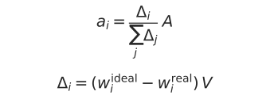
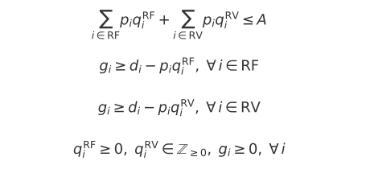

# Otimização de Aportes

# Tabela de Conteúdo
- [Otimização de Aportes](#otimização-de-aportes)
- [Tabela de Conteúdo](#tabela-de-conteúdo)
  - [1. Objetivo](#1-objetivo)
  - [2. Estratégias](#2-estratégias)
    - [2.1 Balaceamento por Défitic Proporcional](#21-balaceamento-por-défitic-proporcional)
    - [2.2 Pesquisa Operacional (PO)](#22-pesquisa-operacional-po)
  - [3. Simulação Backtest](#3-simulação-backtest)
    - [3.1 Dados](#31-dados)
    - [3.2 Metodologia](#32-metodologia)
    - [3.3 Conclusão](#33-conclusão)

## 1. Objetivo

Este estudo parte de **uma carteira já montada** e cada ativo possui um peso-alvo
definido. O desafio é descobrir como atingir o percentual ideal de cada ativo da forma mais inteligente possível utilizando estratégias diferentes.

## 2. Estratégias

### 2.1 Balaceamento por Défitic Proporcional
Calcula-se o déficit (Δ = valor ideal - valor atual) de cada ativo e dividimos o valor do aporte **proporcionalmente** aos déficits.

- A – valor do aporte do mês;
- wideal, wreal – pesos-alvo e pesos atuais;
- V – valor da carteira

### 2.2 Pesquisa Operacional (PO)
Aqui o aporte é tratado como um **problema de otimização**: "*Quanto de cada ativo cabem no valor aportado de forma que reduza o déficit o máximo possível?*"

Para isso, temos uma função otimizada que é a redução do déficit ou gap residual.

- Função Objetivo:
  
    

- Restrição:
  
  

  - RF/RV: Ativo de Renda Fixa ou Renda Variável;
  - A: valor do aporte do mês;
  - pi: Preço do ativo i;
  - di: Déficit do ativo i;
  - qiRF: Quantidade a comprar do ativo i RF;
  - qiRV: Quantidade a comprar do ativo i RV;
  - gi: Gap residual do ativo i

    - Quanto menor o gap (gi), mais perto o ativo fica de seu % ideal;
    - Ativos de RV só aceitam quantidades inteiras, enquanto de RF permitem contínuos.

## 3. Simulação Backtest
aa

### 3.1 Dados
aa
### 3.2 Metodologia
aa

### 3.3 Conclusão

