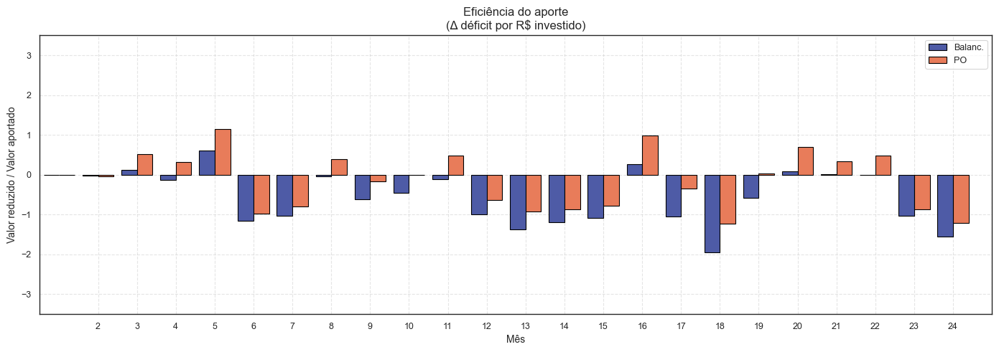

# Otimização de Aportes

# Tabela de Conteúdo
- [Otimização de Aportes](#otimização-de-aportes)
- [Tabela de Conteúdo](#tabela-de-conteúdo)
  - [1. Objetivo](#1-objetivo)
  - [2. Estratégias](#2-estratégias)
    - [2.1 Balaceamento por Défitic Proporcional](#21-balaceamento-por-défitic-proporcional)
    - [2.2 Pesquisa Operacional (PO)](#22-pesquisa-operacional-po)
  - [3. Simulação *Backtest*](#3-simulação-backtest)
    - [3.1 Dados](#31-dados)
    - [3.2 Metodologia](#32-metodologia)
    - [3.3 Comparativo dos Resultados](#33-comparativo-dos-resultados)
      - [3.3.1 Drift por classes](#331-drift-por-classes)
      - [3.3.2 Proporção dos Aportes por Classes](#332-proporção-dos-aportes-por-classes)
      - [3.3.3 Proporção por Subclasses](#333-proporção-por-subclasses)
      - [3.3.4 Eficiência dos Aportes](#334-eficiência-dos-aportes)
      - [3.3.5 Evolução da Carteira e Rentabilidade](#335-evolução-da-carteira-e-rentabilidade)
  - [4. Conclusão](#4-conclusão)

## 1. Objetivo

Este estudo parte de **uma carteira de investimento fictícia já montada** e cada ativo possui um peso-alvo
definido. O desafio é descobrir como atingir o percentual ideal de cada ativo da forma mais inteligente possível utilizando estratégias diferentes.

## 2. Estratégias

### 2.1 Balaceamento por Défitic Proporcional
Calcula-se o déficit (Δ = valor ideal - valor atual) de cada ativo e dividimos o valor do aporte **proporcionalmente** aos déficits.

- A – valor do aporte do mês;
- w ideal, w real – pesos-alvo e pesos atuais;
- V – valor da carteira

### 2.2 Pesquisa Operacional (PO)
Aqui o aporte é tratado como um **problema de otimização**: "*Quanto de cada ativo cabem no valor aportado de forma que reduza o déficit o máximo possível?*"

Para isso, é utilizado um modelo MILP (*Mixed-Integer Linear Programing*) para lidar com variáveis inteiras, como quantidade de cotas no caso de Renda Variável, e contínuas, como em Renda Fixa.

O modelo é calculado buscando otimizar uma função, que no nosso cenário é a redução do déficit ou gap residual.

- Função Objetivo:
  
    

- Restrição:
  
  

  - RF/RV: Ativo de Renda Fixa ou Renda Variável;
  - A: valor do aporte do mês;
  - pi: Preço do ativo i;
  - di: Déficit do ativo i;
  - qiRF: Quantidade a comprar do ativo i RF;
  - qiRV: Quantidade a comprar do ativo i RV;
  - gi: Gap residual do ativo i

    - Quanto menor o gap (gi), mais perto o ativo fica de seu % ideal;
    - Ativos de RV só aceitam quantidades inteiras, enquanto de RF permitem contínuos.

## 3. Simulação *Backtest*
Como forma de comparar as estratégias previamente definidas, foi realizado um *backtest* para um período mensal parametrizável (N=24 meses). Assim, foi realizada uma série de análises de forma a definir a estrategia mais vantajosa.

### 3.1 Dados
| Fonte | Sinal | Observações |
|-------|-------|-------------|
| **Yahoo Finance (`yfinance`)** | cotações de ações/ETFs BR e US (fechamento mensal, “Adj Close”) | preços de ativos US convertidos a BRL via USD/BRL no mesmo dia |
| **BCB SGS 4390** | API BACEN Selic diária - fator acumulado mensal | usada para Tesouro Selic / liquidez de sobras |
| **BCB SGS 433** | API BACEN IPCA mensal - fator acumulado | indexador de CDB-IPCA / fundos atrelados |
| **Constantes fixas** | CDB pré (9 % a.a.) e Previdência (7 % a.a.) | simplificação: taxa homogênea, sem marcação a mercado |

### 3.2 Metodologia

1. **Loop mensal**
   * Atualiza preços de todos os ativos para o último pregão do mês;
   * Aplica o aporte segundo cada método;
   * Eventuais sobras são direcionadas para Selic como "caixa";
2. **Métricas acompanhadas**
   * *drift* por classe;
   * distribuição e qtd. ativos dos aportes por classes e subclasses ao longo dos meses;
   * eficiência dos aportes;
   * rentabilidade e valor do portfolio;

### 3.3 Comparativo dos Resultados

  #### 3.3.1 Drift por classes
  
  
  - Podemos observar que a estratégia por Pesquisa Operacional converge melhor para o ponto ótimo (0 p.p.) do que a estratégia por Balanceamento de Déficits.
  - Além disso, a Pesquisa Operacional (PO) apresenta menor déficit médio e menor volatilidade no déficit, o que indica comportamento mais estável no portfolio.

  #### 3.3.2 Proporção dos Aportes por Classes

  
  - A estratégia por Rebalanceamento mantém os aportes com as mesmas proporções ao longo dos meses, sendo maior em Renda Fixa. Além disso, a quantidade de ativos aportados é bastante pulverizada, buscando priorizar aportes para praticamente todos os ativos do portfolio;

  - Em contrapartida, a estratégia por Pesquisa Operacional "direciona" os aportes de forma mais concentrada para as classes, podendo ser em Renda Fixa ou Renda Variável. A quantidade de ativos aportados também é reduzida.

  #### 3.3.3 Proporção por Subclasses
  
  - Balanceamento: os aportes mantêm uma proporção quase fixa ao longo do tempo, com ~50-60 % sempre em Juros Pós; as demais subclasses recebem participações pequenas e constantes.

  - Já para Pesquisa Operacional, cada mês o aporte é focado na subclasse que está mais distante da meta, direcionando muitas vezes para um 'único alvo' até reduzir o déficit, permitindo também uma correção mais rápida do portfolio

  #### 3.3.4 Eficiência dos Aportes
  - Como métrica de eficiencia, será contabilizada a redução do déficit por R$ investido
  - Δ = déficit mes anterior - deficit atual
  - Caso o Δ déficit for negativo, significa que o déficit da carteira aumentou, ocasionando eficiência negativa.
  - Ef = Δ / Valor Aporte
  
  

  - preencher conculusao
   
  #### 3.3.5 Evolução da Carteira e Rentabilidade
  

  - Aqui podemos ver que a estratégia por Balanceamento apresenta uma rentabilidade mais vantajosa do que Pesquisa Operacional. Isso se explica pelo fato de que o Balanceamento se beneficiou pela Renda Fixa (aportas majortiários, como visto anteriormente), principalmente Pós Fixada, onde a taxa Selic econtra-se em média ~13% a.a. . Ainda assim, o Balanceamento preza por diversificação dos ativos nos momentos de aportes, aproveitando timing de altas e convergindo a um preço médio mais vantajoso.
  - Já a Pesquisa Operacional "dilui o retorno" dos ativos, uma vez que seus aportes são bem concentrados nos ativos de menores gaps (a rentabilidade não é uma preocupação). 

**Trade-off:** diversificar e pulverizar exige mais operações, mas, em cenário de Selic alta + bolsa em alta moderada, entregou melhor rentabilidade que a estratégia de correção pontual via PO.

## 4. Conclusão

